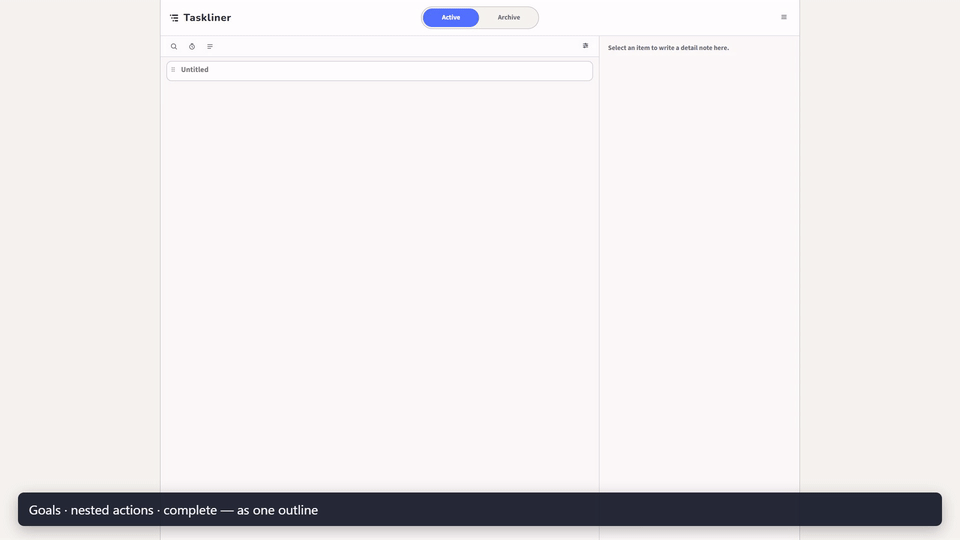

# Taskliner

<p align="center">
  
</p>

**A fast, keyboard-first task outliner.**  
Local-first, private, open source, and ad-free.

**Official app:** [https://taskliner.app](https://taskliner.app)

## Screenshot

<p align="center">
  
</p>

## Features

- Infinite-depth outline editing that feels like Markdown bullets
- Keyboard-first navigation, indent, split, focus, and complete
- Collapse / expand, focus (zoom), search, and due-date sorting
- Optional due dates and Markdown detail notes
- Mobile branch / outline views with quick add and reorder
- JSON export / import with schema versioning
- Japanese and English UI
- Optional Discord completion webhook (sent from your browser)
- Optional end-to-end encrypted Google Drive sync

## Keyboard essentials

| Action | Shortcut |
| --- | --- |
| Indent / outdent | `Tab` / `Shift+Tab` |
| Add / split line | `Enter` |
| Complete / restore | `Ctrl+Enter` |
| Focus current item | `Ctrl+.` |
| Step back from focus | `Esc` |
| Undo | `Ctrl+Z` |

More shortcuts are listed in the in-app help (`?`).

## Local-first and data ownership

- Local use needs **no account**
- Task content is stored in your browser (IndexedDB; legacy `localStorage` is migrated safely)
- Taskliner does **not** store your task titles or notes in its own D1/KV database
- You can export and import JSON at any time

## Google Drive sync (optional)

If you connect Google:

1. Your browser encrypts sync artifacts with a workspace key (AES-256-GCM)
2. Cloudflare Pages Functions relay OAuth and Drive `appDataFolder` traffic
3. Encrypted artifacts live in **your** Google Drive app data folder
4. Device unlock uses a Taskliner passkey (WebAuthn PRF when available), existing-device approval, or a recovery file

Sync is optional. Local-only use stays account-free.

## Security boundary (short)

**Protected in the sync path:** task content, Discord Webhook URL, workspace key material, and recovery material — kept out of Taskliner’s own long-term D1/KV storage as plaintext.

**Not covered by sync encryption:** plaintext local IndexedDB on your device, compromised browsers/devices, screen capture, and losing every unlock method (devices + passkey + recovery file).

This repository documents the model for transparency. It is **not** a formal security audit. See [docs/security-model.md](./docs/security-model.md).

## Build Week: Codex and GPT-5.6

Taskliner was substantially extended during OpenAI Build Week using Codex with GPT-5.6. The project was developed through a repeatable loop of specification, implementation, automated testing, real-browser verification, debugging, and release preparation.

The public repository was prepared as a clean release snapshot on July 21, 2026 because some development logs were not suitable for public release. Its public Git history contains five release-preparation commits. The complete commit-preserving repository log is attached separately as a ZIP with the Build Week submission. The full phase-by-phase development record is also documented in [docs/codex-development-history.md](./docs/codex-development-history.md) and [docs/codex-session-work-map.md](./docs/codex-session-work-map.md).

### Where Codex accelerated the workflow

- Turned cross-cutting design work into small implementation and test iterations across the outline model, storage, sync, encryption, pairing, and mobile UI.
- Reproduced browser-only issues in the live UI, including mobile sheet behavior, sync overwrite cases, tutorial isolation, and production security headers, then carried each fix back into code and tests.
- Made failure cases explicit and testable: empty remote state, stale devices, account mismatch, retries, tombstones, OAuth failures, encryption boundaries, and pairing recovery.
- Extended the same quality loop to release preparation, including deployment checks, public-surface review, manual QA, and demo materials.

### Key product and engineering decisions

| Area | Decision | Reason |
| --- | --- | --- |
| Data ownership | Local-first use remains account-free; optional sync stores encrypted artifacts in the user's Google Drive app data folder. | Keep the core experience usable without an account and keep task content outside the service's long-term database. |
| Security boundary | Encryption, merge, and projection stay in the browser; the server handles transport and outer validation. | Avoid exposing task content to the service. |
| Mobile UX | Mobile uses a branch-oriented view instead of a shrunken desktop layout. | Preserve context while navigating deep outlines on a small screen. |
| Sync safety | Pull, retry, stale-device handling, tombstones, and conflict cases are conservative and test-driven. | Prevent silent data loss and make recovery paths explicit. |

### How GPT-5.6 and Codex were used

GPT-5.6 supported product framing, architecture comparisons, mobile information design, sync and recovery UX, and refinement of the user-facing explanation. Codex translated those decisions into repository-wide changes, tests, Git iterations, browser verification, deployment checks, and release evidence.

The important distinction is that Codex was used as the implementation and verification partner, not only as a code generator: it connected research, design, coding, testing, real-UI debugging, and release preparation in one workflow. The detailed, evidence-based history is in [docs/codex-development-history.md](./docs/codex-development-history.md).

## Run locally (static UI)

No dependency install is required for the static shell.

```bash
python -m http.server 5173
```

Open `http://localhost:5173`.

This serves the UI only. OAuth and sync APIs need Pages Functions (see [docs/self-hosting.md](./docs/self-hosting.md)).

## Tests

```bash
node --test tests/*.test.mjs
node --check app.js
```

Manual checks: [docs/manual-tests.md](./docs/manual-tests.md).

## Self-hosting

You can host the static UI yourself, and optionally wire Google OAuth + Cloudflare Functions for sync.

Self-hosting is provided for reproducibility under the MIT License. It is **not** an offer of managed support, and a self-hosted site must not be presented as the official Taskliner service. See [docs/self-hosting.md](./docs/self-hosting.md) and [TRADEMARKS.md](./TRADEMARKS.md).

## Feedback and contributions

Bug reports and concrete feedback are welcome.

Taskliner is mainly developed by the maintainer. Replies, fixes, and pull request review are not guaranteed. Large changes need an Issue discussion first. See [CONTRIBUTING.md](./CONTRIBUTING.md) and [SUPPORT.md](./SUPPORT.md).

## License and trademarks

- Source code: [MIT License](./LICENSE)
- Name, logo, and brand assets: **not** covered by the MIT License — see [TRADEMARKS.md](./TRADEMARKS.md)
- Third-party notices: [THIRD_PARTY_NOTICES.md](./THIRD_PARTY_NOTICES.md)

## Further reading

- [docs/architecture.md](./docs/architecture.md)
- [docs/security-model.md](./docs/security-model.md)
- [docs/self-hosting.md](./docs/self-hosting.md)
- [SECURITY.md](./SECURITY.md)
